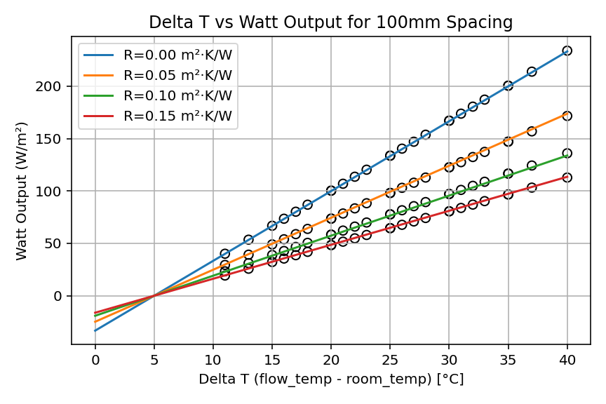
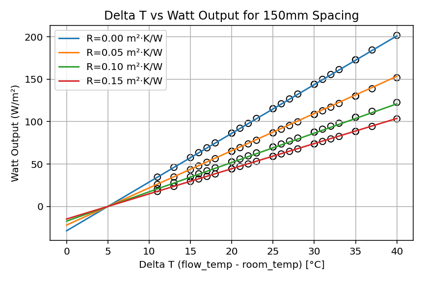
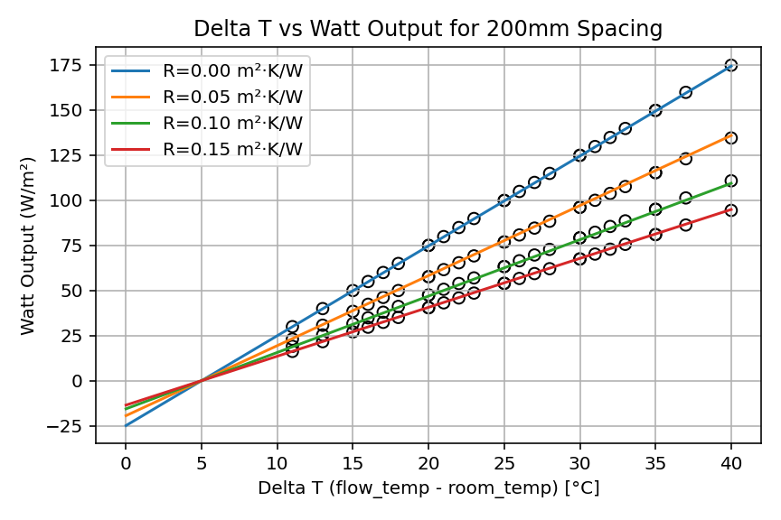
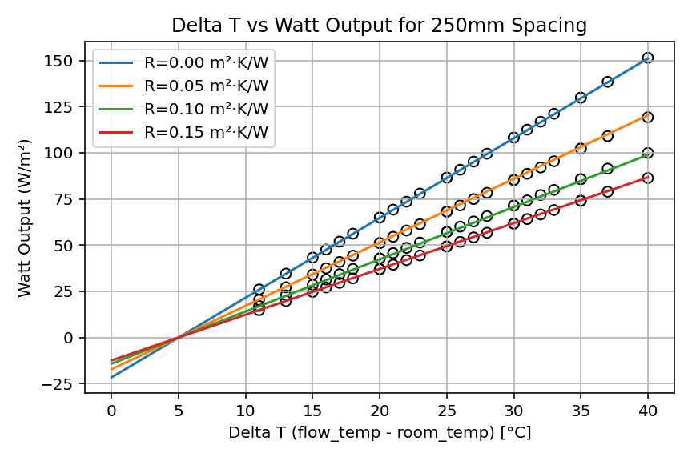
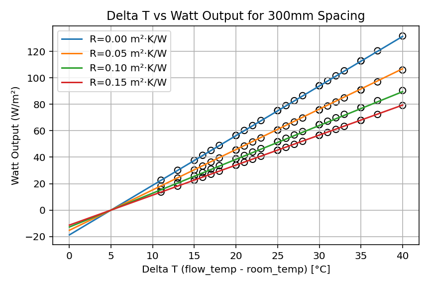

Underfloor Heating Output Quadratic Model
=========================================

This project provides a small Python library for predicting the heat output of underfloor heating (UFH) systems based on the emitter tables from the **MCS Heat Pump Calculator v1.10**.

It reproduces the UFH output (W/m²) for:

- 16 mm pipe
- solid screed floor
- pipe spacings of **100, 150, 200, 250 and 300 mm**
- floor-covering R-values around **0.00–0.15 m²·K/W**

The model is:

- **linear in Delta T** (flow temperature minus room temperature), and  
- **quadratic in floor-cover R** for each pipe spacing.

At runtime you only need the closed-form equations – the MCS CSV is used once to generate the coefficients.


Example
-------

```
% python3
Python 3.14.0 (main, Oct  7 2025, 09:34:52)
Type "help", "copyright", "credits" or "license" for more information.
>>> from ufh_output_funcs import ufh_heat_output
>>> watts_m2 = ufh_heat_output(
...     pipe_spacing=150,
...     r_value=0.00,
...     flow_temp=40,
...     room_temp=20,
... )
>>> print(watts_m2)
86.17327
>>>
```


Files
-----

* `ufh_output_funcs.py`: Contains functions to calculate heat output using quadratic equations
* `mcs-solid-16mm-table.csv`: This CSV contains values from the MCS Calculator (Excel 1.10) for a 16mm pipe in a solid floor. Used only when (re)generating coefficients.
* `ufh_quadratic_calc.py`: Script that reads the CSV and computes the best-fit quadratic equations for each pipe spacing.
* `test_ufh_output.py`: Unit tests that compare the fitted equations against reference points from the MCS table.
* `plot_deltaT_vs_output.py`: Helper script to visually compare the fitted curves against the MCS data for each pipe spacing.


Floor Coverings
---------------

The R-value represents the thermal resistance of the floor covering above the screed (higher R means more insulating and lower heat output).

Typical examples:
| R (m²·K/W) | Rough tog | Example floor coverings                                         |
|-----------:|-----------|-----------------------------------------------------------------|
| 0.00       | 0.0 tog   | Bare screed; thin ceramic/stone tiles                           |
| 0.05       | 0.5 tog   | Thin vinyl / LVT; laminate                                      |
| 0.10       | 1.0 tog   | ~10–12 mm engineered wood glued down; low-tog carpet + underlay |
| 0.15       | 1.5 tog   | Thicker engineered wood or parquet; typical carpet + underlay   |


How good is the fit?
--------------------

The following plots compare the result of the quadratic equation against the MCS data points.








Development
-----------

To run these calculations yourself, you need to install Python and the library dependencies.
It is recommended to use venv:

```sh
python3 -m venv venv
source venv/bin/activate
pip3 install -r requirements.txt
```
